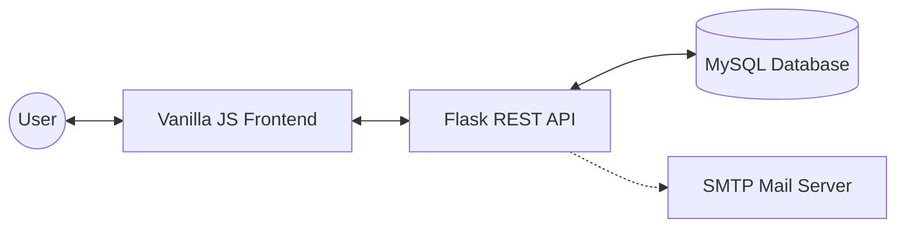

# StudentsHelper - Community Learning Platform

[](https://github.com/your-username/students-helper)
[](https://github.com/your-username/students-helper)

StudentsHelper is a high-performance community platform built to facilitate peer-to-peer academic assistance. It connects students who need help with expert students who can solve problems, featuring a secure bounty escrow system, reputation tracking, and real-time verification.

## 🚀 Current Status: Production-Ready (Core Features Complete)

The platform has reached a stable production-ready state with a fully implemented security stack, automated verification flows, and robust database integrity.

- **Backend**: Flask (Python) with structured logging and middleware guards.
- **Database**: MySQL with performance-optimized indexing and relational integrity.
- **Auth Stack**: bcrypt (Salted Hashing) + JWT (JSON Web Tokens) with 24h expiry.
- **Email Engine**: Flask-Mail via SMTP for secure transactional messaging.
- **Frontend**: Modern Glassmorphic UI built with Vanilla JS and shared component architecture.

## 🏗️ System Architecture

Our platform follows a decoupled client-server architecture, optimized for scalability and secure data flows.



- **Frontend**: Communicates with the backend via fetch APIs and utilizes `localStorage` for JWT persistence.
- **Backend**: A robust REST API providing stateless authentication, logic validation, and database abstraction.
- **Database**: Relational storage using MySQL with optimized schemas and performance indexing.
- **Mail Server**: Transactional email engine for secure account verification.

## 🔄 Core Feature Flow

The platform implements a "Proof-of-Help" lifecycle to ensure fair point distribution:

1.  **Onboarding**: User registers → Receives 100 PTS bonus.
2.  **Verification**: User registers → Email verification sent → User clicks link → Account activated.
3.  **Creation**: Verified user posts a bounty → Points held in **Escrow**.
4.  **Collaboration**: Community member "Claims" the node → Submits Answer.
5.  **Resolution**: Owner accepts answer → Escrowed points automatically awarded to Solver.

## 📡 API Request/Response Example (Sample)

### Request: Register Account
`POST /register`
```json
{
    "first_name": "Nagi",
    "email": "nagi@example.com",
    "password": "securePassword123"
}
```

### Response: Success
```json
{
    "message": "User registered successfully",
    "email_sent": true
}
```

---

## ✨ Implemented Features

### 🔐 Security & Identity
- **OAuth 2.0 Integration**: 
    - Full support for **Google** and **GitHub** authentication via Authlib.
    - Seamless session handoff from OAuth providers to JWT-secured local state.
- **Robust Email Verification**: 
    - Automated verification link dispatch on registration.
    - **is_verified** state enforcement across all restricted endpoints.
    - Secure 32-character url-safe verification tokens.
    - Automated purification: Unverified accounts older than 7 days are automatically purged.
- **JWT-Protected API**: All sensitive actions require valid Bearer token verification.
- **Bcrypt Hashing**: Military-grade password storage.
- **Rate Limiting**: Integrated `Flask-Limiter` to protect against brute-force and DDoS attempts.

### 💰 Bounty & Economy System
- **Escrow Logic**: Points are automatically deducted and held in escrow when a request is posted.
- **Automated Payouts**: Bounties are instantly awarded to solvers upon answer acceptance.
- **Starting Balance**: 100 PTS onboarding credit and reputation for every active node.
- **Referral System**: 
    - Unique referral codes for every user.
    - Commission-based earnings for onboarding new active nodes.
- **Reputation (Ledger)**: Real-time global leaderboard with performance-based rankings.

### ⏱️ Request Lifecycle & "Hunt Mode"
- **Claiming System**: Integrated "Hunt Mode" allowing users to claim objectives, signaling active work to prevent duplicate efforts.
- **Expiry Intelligence**: Real-time tracking of request availability with automated bounty returns for expired tasks.
- **Dynamic Badging**: Automatic state transitions (Open → Expiring Soon → Solved/Expired).

### 📱 SaaS-Level UI/UX
- **Terminal Command Palette**: `Ctrl+K` interface for ultra-fast navigation and system operations.
- **Performance Analytics**: Dynamic Chart.js integration visualizing "Cycle Efficiency" and activity trends.
- **Unified Component System**: Shared `sidebar.js` and `global.css` ensure 100% UI consistency.
- **Verification Banners**: Dynamic warning banners with integrated "Resend Link" functionality.
- **Notification Engine**: Real-time alerts for request interactions and solution submissions.

---

## 🛠️ Tech Stack

- **Backend**: Python 3.13, Flask, Authlib (OAuth), Flask-Mail, Flask-CORS, Flask-Limiter, PyJWT, bcrypt.
- **Database**: MySQL 8.0+ (Optimized with Full-Text indexing and Relationship constraints).
- **Frontend**: HTML5, Vanilla CSS3 (Custom Design System), ES6+ JavaScript, Lucide Icons, Chart.js.

---

## 🏗️ Architecture & Security Best Practices

### Backend Guardrails
We implement strict validation middleware:
```python
# Example of the verification guard applied to posting
if not user_check or user_check.get("is_verified") == 0:
    return jsonify({"message": "Please verify your email", "error_code": "EMAIL_UNVERIFIED"}), 403
```

### Database Schema
The `users` table is hardened with verification metadata:
- `is_verified`: Boolean flag for account activation.
- `verification_token`: Unique hash for activation.
- `token_expires_at`: 24-hour TTL for verification links.
- `created_unverified_at`: Timestamp for auto-cleanup logic.

---

## 🚦 Quick Start

### 1. Backend Setup
```bash
cd backend
python -m venv .venv
source .venv/bin/activate  # Or .venv\Scripts\activate on Windows
pip install -r requirements.txt
```

### 2. Configure Environment
Create a `.env` file in the `backend/` directory using `.env.example` as a template. **NEVER share this file.**

```env
DB_HOST=localhost
DB_USER=root
DB_PASSWORD=your_secure_password
DB_NAME=student_helper
JWT_SECRET=your_secret_key
MAIL_USERNAME=your_email@gmail.com
MAIL_PASSWORD=your_app_password
FRONTEND_URL=http://127.0.0.1:5501
```

### 3. Initialize & Run
```bash
python app.py
```
Backend will be available at `http://127.0.0.1:5001`.

---

## 🔒 Security Fix Guide: Removing Exposed Secrets

If you accidentally pushed your `.env` file to GitHub, follow these critical steps immediately:

1. **Remove from Git History**:
   ```bash
   git rm --cached .env
   git commit -m "chore: remove sensitive .env file from tracking"
   git push origin main
   ```
2. **Add to .gitignore**: Ensure `.env` is listed in your `.gitignore` file.
3. **Rotate Credentials**: Change your DB password, Gmail App Password, and `JWT_SECRET` immediately. Once a secret is pushed to GitHub, it is considered compromised forever.

---

## 📖 Best Practices Guide

### What is `.gitignore`?
Think of `.gitignore` as a "blacklist" for Git. It tells Git which files or folders to ignore and never upload to your repository. This is vital for excluding:
- **Secrets** (`.env`)
- **Temp Files** (`__pycache__`, `.DS_Store`)
- **Dependencies** (`node_modules`, `.venv`)

### `.env` vs `.env.example`
- **`.env`**: Contains your **real secrets** (passwords, keys). This file stays ONLY on your local machine.
- **`.env.example`**: A template folder with **fake values** but correct keys. You push this to GitHub so other developers know which variables they need to set up.

---

## 🧪 Testing
The system includes a rigorous QA validation suite. To run automated verification tests:
```bash
cd backend
python qa_test.py
```

---

## 📝 License
This project is open-source. Please attribute the original author when using this implementation in your own portfolio.

---

## 🏗️ Repository Organization
The repository is structured for professional development workflows:
- `backend/`: Core REST API logic, database schemas, and mail templates.
- `frontend/`: Multi-page Glassmorphic UI with shared component injection.
- `scripts/`: Maintenance, migration, and automation utilities.

## 🌟 Why This Project Matters
This platform serves as a production-grade blueprint for peer-to-peer (P2P) economy systems. It demonstrates how to handle complex financial logic (Escrow), secure identity management (JWT + Multi-stage Verification), and real-time community engagement in a performant, lightweight environment. It is designed to showcase mastery over full-stack security, data integrity, and modern UI design.
