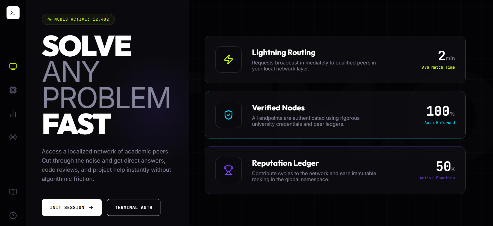
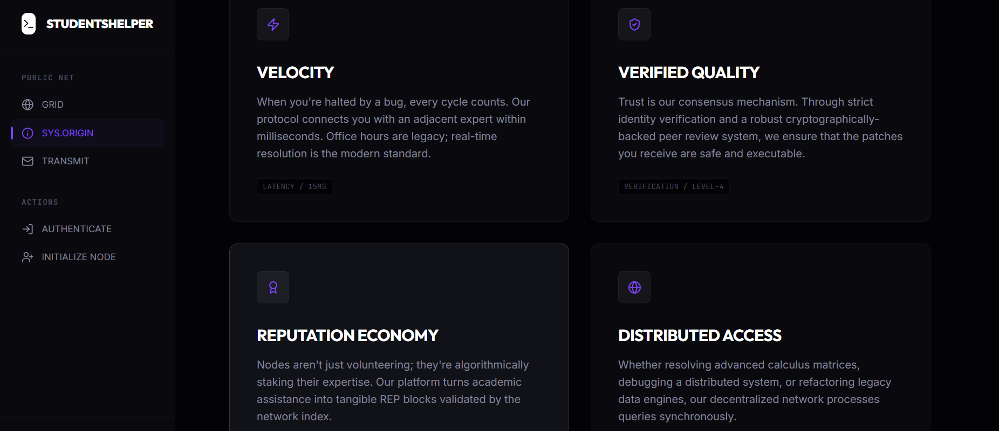
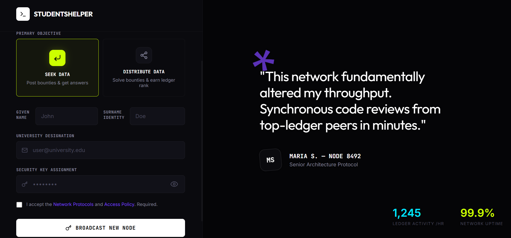
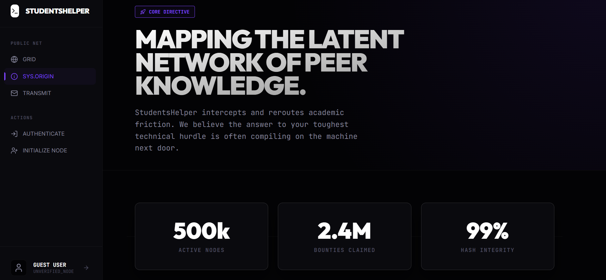
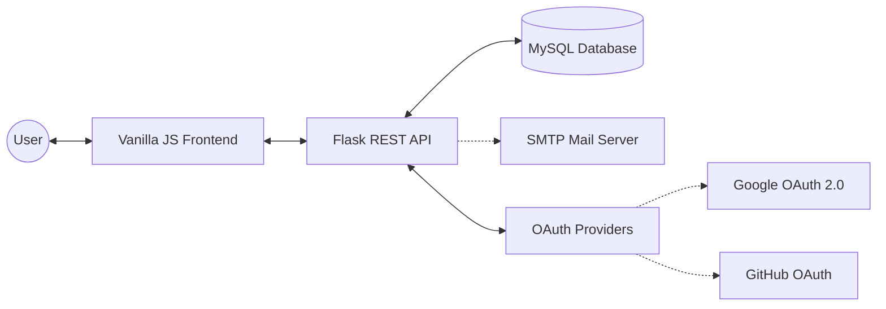
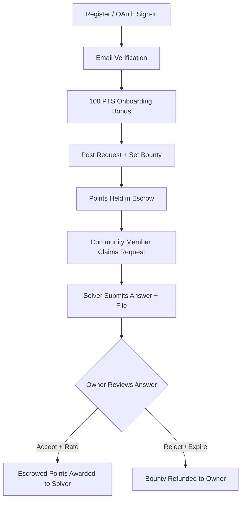

# StudentsHelper — Community Learning Platform

[](https://github.com/your-username/students-helper)
[](https://github.com/your-username/students-helper)
[](https://github.com/your-username/students-helper)
[](https://github.com/your-username/students-helper)

StudentsHelper is a full-stack community platform that facilitates **peer-to-peer academic assistance**. Students who need help post bounty-backed requests; expert students claim and solve them, earning reputation and points through a secure escrow system.
 The platform features OAuth sign-in, email verification, a referral program, real-time notifications, and a glassmorphic dark-mode UI.

- **Backend**: Flask (Python) with structured logging and middleware guards.
- **Database**: MySQL with performance-optimized indexing and relational integrity.
- **Auth Stack**: bcrypt (Salted Hashing) + JWT (JSON Web Tokens) with 24h expiry.
- **Email Engine**: Flask-Mail via SMTP for secure transactional messaging.
- **Frontend**: Modern Glassmorphic UI built with Vanilla JS and shared component architecture.

---

## 📸 Screenshots

### Landing Page
> The entry point with bold editorial typography, real-time network stats, and a sleek dark interface.



### About Page
> Core platform values — velocity, verified quality, reputation economy, and distributed access.



### Registration Page
> Dual-mode onboarding (Seek Data / Distribute Data) with social proof and peer testimonials.



### Dashboard
> Full workspace view with navigation tree, network metrics, and platform statistics.



---

## 🏗️ System Architecture

The platform follows a **decoupled client-server architecture** optimized for scalability and secure data flows.



| Layer | Description |
|-------|-------------|
| **Frontend** | Multi-page Glassmorphic UI built with Vanilla JS. Communicates via `fetch` API; stores JWT in `localStorage`. |
| **Backend** | Stateless Flask REST API handling authentication, business logic, and database abstraction. |
| **Database** | MySQL 8.0+ with relational integrity, performance indexes, and full-text search. |
| **Mail** | Transactional email via SMTP (Flask-Mail) for account verification. |
| **OAuth** | Google & GitHub sign-in via Authlib with automatic account provisioning. |

---

## 🔄 Core Feature Flow

The platform implements a **"Proof-of-Help"** lifecycle to ensure fair point distribution:



1. **Onboarding** — Register (email or OAuth) → receive **100 PTS** starting balance.
2. **Verification** — Email link sent → user clicks → account activated (24 h TTL).
3. **Request Creation** — Verified user sets a bounty → points held in **escrow**.
4. **Claiming** — Community member enters "Hunt Mode" and claims the objective.
5. **Answering** — Solver submits a text answer with optional file attachment.
6. **Resolution** — Owner accepts + rates the answer → escrowed bounty + bonus awarded.
7. **Expiry** — Unanswered requests auto-expire after 7 days; bounty is refunded.

---

## ✨ Implemented Features

### 🔐 Authentication & Security
| Feature | Details |
|---------|---------|
| **Email + Password** | Bcrypt-hashed (12 rounds), JWT-protected 24 h sessions. |
| **Google OAuth 2.0** | One-click sign-in via Authlib; auto-provisions new accounts. |
| **GitHub OAuth** | One-click sign-in; fetches primary email from GitHub API. |
| **Email Verification** | 32-char URL-safe tokens, 24 h TTL, verification-gated endpoints. |
| **Auto-Cleanup** | Unverified accounts purged after 7 days to prevent database bloat. |
| **Rate Limiting** | `Flask-Limiter` guards on all mutation endpoints. |
| **Input Validation** | Server-side validation on every field (email format, password strength, title/description length). |

### 💰 Economy & Bounty System
| Feature | Details |
|---------|---------|
| **Escrow Logic** | Points auto-deducted on request creation, held until resolution. |
| **Automated Payouts** | Bounty + 20 PTS bonus awarded to solver on answer acceptance. |
| **Refund on Expiry** | Escrowed bounty returned when request expires without a solution. |
| **Reputation Ledger** | Global leaderboard ranked by cumulative reputation score. |
| **Referral Program** | Unique referral codes per user; referrer earns **10 %** commission on referred user's bounties. |

### ⏱️ Request Lifecycle
| Feature | Details |
|---------|---------|
| **Categories** | Requests can be tagged with a subject category for filtering. |
| **Claim / Unclaim** | Users can claim an open request to signal active work, and unclaim if needed. |
| **File Attachments** | Answers can include file uploads (stored server-side). |
| **Upvotes & Ratings** | Community can upvote answers; owners rate answers on acceptance. |
| **Expiry Intelligence** | 7-day TTL with automatic state transitions (Open → Expiring → Expired). |
| **Pagination & Search** | Server-side pagination, full-text search, category and sort filters. |
| **View Counter** | Each request tracks view count incremented on detail page load. |
| **Delete with Refund** | Owners can delete their request; escrowed bounty is returned. |

### 📱 UI / UX
| Feature | Details |
|---------|---------|
| **Glassmorphic Design** | Frosted-glass cards, vibrant gradients, and smooth micro-animations. |
| **Dark Mode** | Native theme toggle persisted in `localStorage`. |
| **Shared Sidebar** | Injected via `sidebar.js` for 100 % navigation consistency across all pages. |
| **Verification Banners** | Dynamic warning banners with "Resend Link" for unverified users. |
| **Notification Engine** | Real-time alerts for request interactions and answer submissions. |
| **Responsive Layout** | Mobile-friendly across all 19 pages. |
| **Command Palette** | `Ctrl+K` for quick navigation across pages and actions. |
| **Performance Charts** | Chart.js-powered metrics visualization on the dashboard. |

---

## 🛠️ Tech Stack

| Layer | Technologies |
|-------|-------------|
| **Backend** | Python 3.x · Flask · Flask-Mail · Flask-CORS · Flask-Limiter · Authlib · PyJWT · bcrypt |
| **Database** | MySQL 8.0+ (full-text indexing, window functions) |
| **Frontend** | HTML5 · CSS3 (Custom Properties) · ES6+ JavaScript · Chart.js |
| **Auth** | JWT (HS256, 24 h) · Google OAuth 2.0 · GitHub OAuth · Bcrypt |
| **DevOps** | python-dotenv · VS Code Live Server (frontend dev server) |

---

## 📄 Pages & UI

The frontend consists of **19 dedicated pages**, all sharing a unified component system (`sidebar.js`, `global.css`):

| Page | File | Purpose |
|------|------|---------|
| Landing | `index.html` | Marketing page / entry point |
| Login | `login.html` | Email + OAuth sign-in |
| Register | `register.html` | Account creation with optional referral code |
| Verify | `verify.html` | Email verification handler |
| Dashboard | `dashboard.html` | Metrics overview, active bounties, quick actions |
| Request Help | `request-help.html` | Create a new bounty-backed request |
| View Requests | `view-requests.html` | Browse, search, filter open requests |
| Request Details | `request-details.html` | Full request + answers, claiming, upvoting |
| Help Others | `help-others.html` | Discover requests to solve |
| My Requests | `my-requests.html` | Manage your posted requests |
| Community Chat | `community-chat.html` | Community posts feed |
| Leaderboard | `leaderboard.html` | Global reputation rankings |
| Profile | `profile.html` | View your own profile & stats |
| User Profile | `user-profile.html` | View another user's public profile |
| Settings | `settings.html` | Account settings & preferences |
| Change Password | `change-password.html` | Password update form |
| Notifications | `notifications.html` | In-app notification center |
| About | `about.html` | Platform information |
| Contact | `contact.html` | Contact / feedback form |

---

## 📡 API Reference

### Authentication

| Method | Endpoint | Description | Auth |
|--------|----------|-------------|------|
| `POST` | `/register` | Create account (email + password) | — |
| `POST` | `/login` | Email/password login → JWT | — |
| `GET` | `/auth/google` | Initiate Google OAuth flow | — |
| `GET` | `/auth/google/callback` | Google OAuth callback | — |
| `GET` | `/auth/github` | Initiate GitHub OAuth flow | — |
| `GET` | `/auth/github/callback` | GitHub OAuth callback | — |
| `GET` | `/verify_email?token=…` | Activate account via token | — |
| `POST` | `/resend_verification` | Resend verification email | — |

### Requests & Bounties

| Method | Endpoint | Description | Auth |
|--------|----------|-------------|------|
| `POST` | `/post_request` | Create a new bounty request | JWT |
| `GET` | `/get_requests` | List requests (paginated, searchable) | — |
| `GET` | `/get_request_details/<id>` | Get full request + answers + claims | — |
| `GET` | `/get_my_requests` | List the authenticated user's requests | JWT |
| `GET` | `/get_archived_requests` | List solved / closed requests | — |
| `GET` | `/get_active_bounties` | List open requests with bounties | — |
| `POST` | `/delete_request` | Delete own request + refund escrow | JWT |

### Answers

| Method | Endpoint | Description | Auth |
|--------|----------|-------------|------|
| `POST` | `/post_answer` | Submit answer (text + optional file) | JWT |
| `GET` | `/get_answers/<id>` | Get answers for a request | — |
| `POST` | `/accept_answer` | Accept + rate an answer → payout | JWT |
| `POST` | `/upvote_answer` | Upvote an answer (+10 rep to author) | — |

### Claims

| Method | Endpoint | Description | Auth |
|--------|----------|-------------|------|
| `POST` | `/claim_request` | Claim an open request | JWT |
| `DELETE` | `/unclaim_request` | Release a claimed request | JWT |

### Users & Stats

| Method | Endpoint | Description | Auth |
|--------|----------|-------------|------|
| `GET` | `/user_stats` | Get authenticated user's stats & rank | JWT |
| `GET` | `/get_balance` | Get user point balance | JWT |
| `GET` | `/dashboard_metrics` | Dashboard KPIs (bounties cleared, pending) | JWT |
| `GET` | `/leaderboard` | Global reputation leaderboard | — |
| `POST` | `/update_reputation` | Manually adjust reputation | — |
| `POST` | `/purge_user` | Delete all user data (destructive) | — |

### Community & Notifications

| Method | Endpoint | Description | Auth |
|--------|----------|-------------|------|
| `GET` | `/get_posts` | List community posts | — |
| `POST` | `/create_post` | Create a community post | — |
| `POST` | `/accept_post` | Capture / claim a community post | — |
| `GET` | `/notifications` | Get user notifications | JWT |

---

## 🚦 Quick Start

### Prerequisites

- **Python 3.10+**
- **MySQL 8.0+** (running locally or remotely)
- **VS Code** with [Live Server extension](https://marketplace.visualstudio.com/items?itemName=ritwickdey.LiveServer) (for frontend)

### 1. Clone & Setup Backend

```bash
git clone https://github.com/your-username/student-helper.git
cd student-helper/backend

# Create virtual environment
python -m venv .venv

# Activate (Windows)
.venv\Scripts\activate
# Activate (macOS/Linux)
source .venv/bin/activate

# Install dependencies
pip install -r requirements.txt
```

### 2. Configure Environment Variables

Copy `.env.example` to `.env` in the `backend/` directory and fill in your values:

```bash
cp .env.example .env
```

> ⚠️ **Never commit `.env` to version control.**

### 3. Start the Backend

```bash
cd backend
python app.py
```

Backend available at **`http://127.0.0.1:5001`**. The database and tables are auto-created on first run.

### 4. Start the Frontend

Open the project in VS Code and click **"Go Live"** in the status bar. The Live Server is pre-configured to serve from the `frontend/` directory.

Frontend available at **`http://127.0.0.1:5504`** (configured in `.vscode/settings.json`).

> **Note:** Live Server root is set to `/frontend` in `.vscode/settings.json` so it serves the app directly without requiring a redirect file at the project root.

---

## ⚙️ Environment Variables

Create a `backend/.env` file with the following keys:

| Variable | Required | Description |
|----------|----------|-------------|
| `DB_HOST` | ✅ | MySQL host (default: `localhost`) |
| `DB_USER` | ✅ | MySQL user (default: `root`) |
| `DB_PASSWORD` | ✅ | MySQL password |
| `DB_NAME` | ✅ | Database name (default: `student_helper`) |
| `DB_PORT` | — | MySQL port (default: `3306`) |
| `JWT_SECRET` | ✅ | Secret key for JWT signing (32+ chars recommended) |
| `FLASK_SECRET_KEY` | ✅ | Flask session secret for OAuth |
| `CORS_ORIGINS` | — | Comma-separated allowed origins |
| `MAIL_SERVER` | ✅ | SMTP server (default: `smtp.gmail.com`) |
| `MAIL_PORT` | — | SMTP port (default: `587`) |
| `MAIL_USE_TLS` | — | Enable TLS (default: `1`) |
| `MAIL_USERNAME` | ✅ | SMTP email address |
| `MAIL_PASSWORD` | ✅ | SMTP app password |
| `MAIL_DEFAULT_SENDER` | ✅ | Sender email address |
| `GOOGLE_CLIENT_ID` | — | Google OAuth 2.0 Client ID |
| `GOOGLE_CLIENT_SECRET` | — | Google OAuth 2.0 Client Secret |
| `GITHUB_CLIENT_ID` | — | GitHub OAuth App Client ID |
| `GITHUB_CLIENT_SECRET` | — | GitHub OAuth App Client Secret |
| `FRONTEND_URL` | — | Frontend URL for verification links (default: `http://127.0.0.1:5502`) |

> **Tip:** Generate a strong JWT secret with: `python -c "import secrets; print(secrets.token_urlsafe(32))"`

---

## 📁 Repository Structure

```
student-helper/
├── backend/
│   ├── app.py              # Flask REST API (all routes & logic)
│   ├── requirements.txt    # Python dependencies
│   ├── .env.example        # Environment variable template
│   ├── uploads/            # User-uploaded answer attachments
│   └── FIXES_APPLIED.md    # Changelog of applied bug fixes
│
├── frontend/
│   ├── index.html          # Landing page
│   ├── favicon.ico         # Site favicon
│   ├── favicon.png         # Site favicon (PNG format)
│   ├── package.json        # Frontend dev server config
│   ├── css/
│   │   ├── global.css      # Shared design tokens & utilities
│   │   └── style.css       # Page-specific styles
│   ├── js/
│   │   ├── sidebar.js      # Shared sidebar component injection
│   │   ├── script.js       # Core frontend logic (auth, API calls)
│   │   ├── dashboard.js    # Dashboard page logic
│   │   ├── leaderboard.js  # Leaderboard page logic
│   │   ├── profile.js      # Profile page logic
│   │   ├── request-help.js # Request creation logic
│   │   ├── contact.js      # Contact form logic
│   │   └── theme.js        # Dark mode toggle
│   └── pages/              # 19 HTML pages (see Pages & UI section)
│
├── docs/
│   └── screenshots/        # Project screenshots for README
│
├── scripts/                # DB patches, QA tests, & maintenance utilities
├── .vscode/
│   └── settings.json       # Live Server config (root: /frontend, port: 5504)
├── .gitignore              # Git exclusion rules
└── README.md               # This file
```

---

## 🔒 Security Guide

### If You Accidentally Pushed `.env` to GitHub

1. **Remove from tracking:**
   ```bash
   git rm --cached backend/.env
   git commit -m "chore: remove .env from tracking"
   git push origin main
   ```

2. **Verify `.gitignore`** includes `.env`.

3. **Rotate ALL credentials immediately:**
   - Database password
   - Gmail App Password
   - `JWT_SECRET`
   - `FLASK_SECRET_KEY`
   - Google / GitHub OAuth secrets

> Once a secret is pushed to a public repo, consider it **permanently compromised**.

### `.env` vs `.env.example`

| File | Purpose | Git-tracked? |
|------|---------|:------------:|
| `.env` | Real secrets — local only | ❌ Never |
| `.env.example` | Template with placeholder values | ✅ Yes |

---

## 🧪 Testing

Run the QA validation suite:

```bash
cd scripts
python qa_test.py
```

---

## 📋 Changelog (Latest)

### v2.6 — Dynamic Leaderboard & Deep Cleanup (April 2026)
- **Dynamicized "Top Nodes" Sidebar**: Implemented a live global leaderboard with a 30-second auto-refresh interval for real-time community engagement.
- **Redesigned Referral Link**: Updated the referral section to a modern "Referral Card" UI with a dedicated COPY button and robust link generation.
- **Deep Database Cleanup**: Automated the removal of legacy test users ("NAGI", "RIN", etc.) and their associated posts/requests to maintain a production-clean environment.
- **Dynamic Identity Protocol**: Added real-time rank/level calculation, progress bars, and personalized active objectives to the user dashboard.
- **Functional Network Filters**: Fully dynamicized the sort and data-type filters in the community feed, enabling seamless switching between help requests and knowledge sharing.
- **UI/UX Refinement**: Removed non-functional search elements and improved the "Node Efficiency" chart on the dashboard.

### v2.5 — Favicon & Project Structure Cleanup (April 2026)

### v2.4 — Command Palette & Performance Charts
- **Added:** Command Palette (`Ctrl+K`) for instant navigation across all pages.
- **Added:** Chart.js-powered performance metrics visualization on the dashboard.

### v2.3 — Bounty, Expiry & Claiming System
- **Added:** Escrow-based bounty flow with automated payouts and refunds.
- **Added:** 7-day request expiry with automatic state transitions.
- **Added:** Claim/unclaim functionality with self-claim prevention.
- **Security:** Blocked request owners from answering or claiming their own requests.

### v2.2 — Email Verification & Referrals
- **Added:** Email verification flow with 24h token expiry.
- **Added:** Referral program with 10% commission on bounties.
- **Added:** Auto-cleanup of unverified accounts after 7 days.

### v2.1 — OAuth & Security Hardening
- **Added:** Google OAuth 2.0 and GitHub OAuth sign-in.
- **Security:** Bcrypt password hashing (12 rounds), JWT authentication.
- **Security:** Rate limiting, input validation, CSP headers.

---

## 📝 License
This project is open-source. Please attribute the original author when using this implementation in your own portfolio.

---

## 🌟 Why This Project Matters
This platform serves as a production-grade blueprint for peer-to-peer (P2P) economy systems. It demonstrates how to handle complex financial logic (Escrow), secure identity management (JWT + Multi-stage Verification), and real-time community engagement in a performant, lightweight environment. It is designed to showcase mastery over full-stack security, data integrity, and modern UI design.
