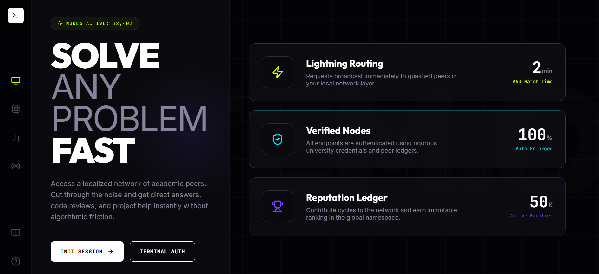
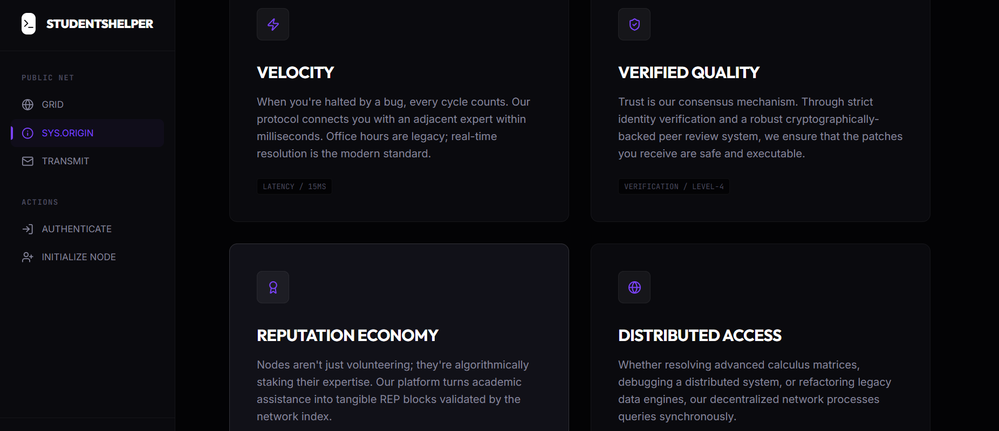
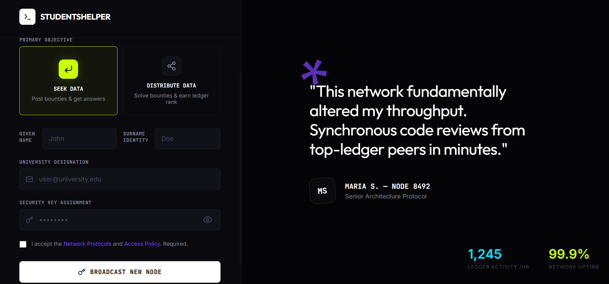
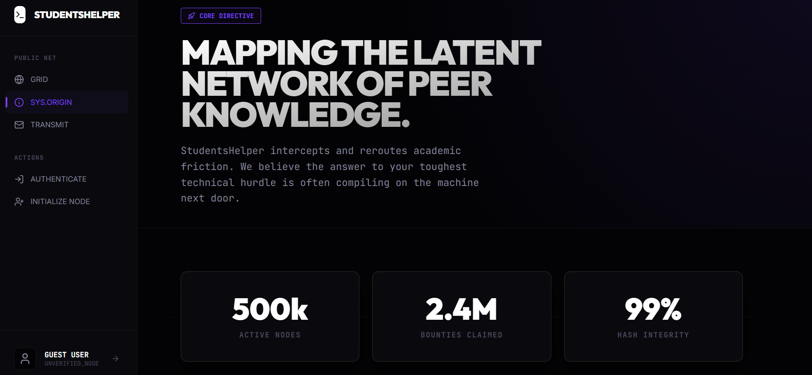

# StudentsHelper — Community Learning Platform

[](#)
[](#)
[](#)
[](#)
[](#)

StudentsHelper is a full-stack community platform that facilitates **peer-to-peer academic assistance**. Students who need help post bounty-backed requests; expert students claim and solve them, earning reputation and points through a secure escrow system.

**Tech Stack:** Flask (Python), SQLite/MySQL, Vanilla JS, HTML/CSS. Auth via JWT, bcrypt, and OAuth (Google & GitHub).

**Latest Release:** May 2026 — Production-ready with enhanced security, OAuth verification, and structured logging.

---

## 📸 Screenshots

<details>
<summary><strong>Click to expand screenshots</strong></summary>

- **Landing Page:** Entry point with bold typography and dark interface.
  
- **About Page:** Core platform values.
  
- **Registration:** Dual-mode onboarding (Seek/Distribute Data).
  
- **Dashboard:** Full workspace view with network metrics.
  
</details>

---


## 🚀 Release Notes — May 2026

### ✅ Major Improvements & Security Fixes
- **CORS Security Hardening:** Removed wildcard CORS; now uses environment-configured allowed origins
- **Secrets Management:** Removed hardcoded credentials; forced `.env` file usage with `.env.example` template
- **Input Validation:** All endpoints now validate email, password, title, description, and bounty inputs
- **Structured Logging:** Added comprehensive logging system for all operations with timestamps and severity levels
- **Improved Error Handling:** Detailed error codes and messages for better debugging and frontend error handling
- **OAuth Email Verification:** Google & GitHub OAuth users now require email verification (consistent with regular auth)
- **JWT Header Authentication:** Core endpoints now support Bearer token in Authorization header for better security
- **API Token Resolution:** Flexible endpoint authentication resolving email from JWT token first, then query parameter for compatibility
- **Missing GET /verify_email Endpoint:** Added endpoint to validate and mark users as verified via email tokens
- **Verification Page Resilience:** Enhanced verify.html with multiple API base URL detection strategies and SERVER_UNREACHABLE error handling

---


## 🏗️ Architecture & Core Flow

- **Frontend:** Multi-page Glassmorphic UI (Vanilla JS). Root directory is `/frontend`. All pages use global CSS and reusable sidebar component.
- **Backend:** Stateless Flask REST API with structured logging, CORS security, and JWT authentication.
- **Database:** SQLite (default) or MySQL 8.0+ with relational integrity (configurable via environment).
- **Authentication:** 
  - JWT tokens (24h TTL) with bcrypt password hashing (12 rounds)
  - Google & GitHub OAuth integration (with mandatory email verification)
  - Bearer token support in Authorization header or email query parameter fallback
- **Request Lifecycle:** 
  1. **Register** (Email/OAuth) → **Email Verification** (24h TTL)
  2. **Post Request** → Bounty points placed in **Escrow**
  3. Community **Claims** and **Solves** objective
  4. Owner **Accepts** → Bounty payout + Reputation earned (Unanswered requests expire in 7 days with auto-refund).

---

## ✨ Key Features

- **Security & Auth:** 
  - JWT sessions with 24h TTL
  - bcrypt password hashing (12 rounds)
  - Rate limiting per user
  - Server-side input validation on all endpoints
  - CORS restricted to configured origins (no wildcard)
  - Google & GitHub OAuth with mandatory email verification
  - Structured logging for audit trails
  - CSP (Content Security Policy) headers for XSS protection

- **Economy & Bounties:** 
  - Secure escrow logic for bounty management
  - Automated payouts with balance tracking
  - 7-day expiry with auto-refund for unanswered requests
  - Referral program (10% commission)
  - User reputation system with badges

- **Requests System:** 
  - Categorized requests (Subjects/Topics)
  - Claim/unclaim logic with request ownership tracking
  - File attachments support
  - Upvotes on answers
  - View counters
  - Request status tracking (open, claimed, solved, archived)

- **Community & Communication:**
  - Community chat feature
  - Answer posting and acceptance system
  - Notifications system (real-time updates)
  - User profile customization with avatar uploads
  - Leaderboard with reputation rankings
  - User stats and achievement tracking

- **UI / UX:** 
  - Glassmorphic dark mode (saved in `localStorage`)
  - Command Palette (`Ctrl+K`)
  - Dashboard with "Share Request", enhanced Empty States, and Chart.js metrics
  - Dynamic shared sidebar with real-time updates
  - Real-time notification engine
  - Responsive design across all pages

---

## 🔐 Security Implementation Summary

| Feature | Implementation |
|---------|-----------------|
| **Password Hashing** | bcrypt with 12 rounds |
| **Session Tokens** | JWT with 24h expiration |
| **CORS Policy** | Environment-configured origins (no wildcard) |
| **Input Validation** | Regex patterns for email, password length checks, content length limits |
| **File Upload Security** | File size limits, type validation, isolated upload directory |
| **Error Messages** | Detailed error codes without exposing system internals |
| **Logging** | Comprehensive audit logs with timestamps and severity levels |
| **Secrets Management** | All credentials via `.env` file (never in code) |
| **OAuth** | Mandatory email verification for all OAuth users |

---

---

## 🚦 Quick Start

### 1. Backend Setup
```bash
git clone https://github.com/your-username/student-helper.git
cd student-helper/backend
python -m venv .venv

# Activate venv: 
# `.venv\Scripts\activate` (Windows)
# `source .venv/bin/activate` (macOS/Linux)

pip install -r requirements.txt
cp .env.example .env
# Edit .env with your database and email credentials
```

> **Team Collaboration Tip:** Teammates should maintain their own personal `.env` files with local database credentials to avoid collaboration conflicts. 

Start the API:
```bash
python app.py # Server available at http://127.0.0.1:5001
```

### 2. Frontend Setup
Open the project in VS Code and click **"Go Live"** via the Live Server extension.
> **Note:** Ensure your Live Server settings (`.vscode/settings.json`) point the root to the `/frontend` directory (default port: 5504).

---

<details>
<summary><h2>⚙️ Environment Variables (<code>backend/.env</code>)</h2></summary>

| Variable | Required | Description |
|----------|----------|-------------|
| `DB_HOST`, `DB_USER`, `DB_PASSWORD`, `DB_NAME` | ✅ | Database credentials (MySQL or SQLite path) |
| `JWT_SECRET` | ✅ | Secret key for signing JWT tokens |
| `FLASK_SECRET_KEY` | ✅ | Flask session secret key |
| `MAIL_SERVER`, `MAIL_USERNAME`, `MAIL_PASSWORD` | ✅ | SMTP credentials for email verification |
| `MAIL_DEFAULT_SENDER` | ✅ | Default sender address (e.g., noreply@studentshelper.com) |
| `GOOGLE_CLIENT_ID`, `GOOGLE_CLIENT_SECRET` | — | OAuth credentials from Google Cloud Console |
| `GITHUB_CLIENT_ID`, `GITHUB_CLIENT_SECRET` | — | OAuth credentials from GitHub Developer Settings |
| `CORS_ORIGINS` | — | Comma-separated list of allowed origins (e.g., http://localhost:5504,http://127.0.0.1:8000) |
| `FRONTEND_URL` | — | Frontend URL for email links and redirects |
| `FLASK_DEBUG` | — | Set to 0 for production, 1 for development |

### Sample .env File
```ini
DB_HOST=localhost
DB_USER=root
DB_PASSWORD=your_secure_password
DB_NAME=student_helper
JWT_SECRET=your_jwt_secret_key_here
FLASK_SECRET_KEY=your_flask_secret_key_here
MAIL_SERVER=smtp.gmail.com
MAIL_USERNAME=your_email@gmail.com
MAIL_PASSWORD=your_app_password
MAIL_DEFAULT_SENDER=noreply@studentshelper.com
GOOGLE_CLIENT_ID=your_google_client_id
GOOGLE_CLIENT_SECRET=your_google_client_secret
GITHUB_CLIENT_ID=your_github_client_id
GITHUB_CLIENT_SECRET=your_github_client_secret
CORS_ORIGINS=http://localhost:5504,http://127.0.0.1:5504,http://localhost:3000
FRONTEND_URL=http://localhost:5504
FLASK_DEBUG=0
```

</details>

---

<details>
<summary><h2>📡 Complete API Reference</h2></summary>

### Authentication Endpoints

| Method | Endpoint | Auth | Description |
|--------|----------|------|-------------|
| POST | `/register` | — | Register new user with email/password |
| POST | `/login` | — | Login user, returns JWT token |
| GET | `/verify_email` | — | Verify email with token from email link |
| POST | `/resend_verification` | — | Resend verification email |
| GET | `/auth/google` | — | Google OAuth login redirect |
| GET | `/auth/google/callback` | — | Google OAuth callback handler |
| GET | `/auth/github` | — | GitHub OAuth login redirect |
| GET | `/auth/github/callback` | — | GitHub OAuth callback handler |

### User Profile Endpoints

| Method | Endpoint | Auth | Description |
|--------|----------|------|-------------|
| GET | `/me` | ✅ JWT | Get current user profile |
| GET | `/user_stats` | ✅ JWT | Get user statistics (requests posted, answers, reputation) |
| POST | `/update_profile_image` | ✅ JWT | Upload user avatar |
| GET | `/uploads/avatars/<filename>` | — | Retrieve uploaded avatar |
| POST | `/update_reputation` | ✅ JWT | Update user reputation |
| GET | `/get_balance` | ✅ JWT | Get user balance/wallet |

### Request Management Endpoints

| Method | Endpoint | Auth | Description |
|--------|----------|------|-------------|
| POST | `/post_request` | ✅ JWT | Create new help request with bounty |
| GET | `/get_requests` | — | Get all active requests (with pagination, filtering, sorting) |
| GET | `/get_request_details/<id>` | — | Get details of specific request |
| GET | `/get_my_requests` | ✅ JWT | Get requests posted by current user |
| GET | `/get_archived_requests` | ✅ JWT | Get archived/closed requests by user |
| GET | `/get_active_bounties` | — | Get requests with active bounties |
| DELETE | `/delete_request` | ✅ JWT | Delete user's request |

### Answer & Claim Endpoints

| Method | Endpoint | Auth | Description |
|--------|----------|------|-------------|
| POST | `/post_answer` | ✅ JWT | Post answer to a request |
| GET | `/get_answers/<id>` | — | Get all answers for a request |
| POST | `/accept_answer` | ✅ JWT | Accept answer and pay bounty |
| POST | `/upvote_answer` | ✅ JWT | Upvote an answer |
| POST | `/claim_request` | ✅ JWT | Claim a request to work on it |
| DELETE | `/unclaim_request` | ✅ JWT | Unclaim a claimed request |

### Dashboard & Analytics Endpoints

| Method | Endpoint | Auth | Description |
|--------|----------|------|-------------|
| GET | `/dashboard_metrics` | ✅ JWT | Get dashboard statistics and charts data |
| GET | `/leaderboard` | — | Get user leaderboard by reputation |
| GET | `/notifications` | ✅ JWT | Get user notifications |

### Community Endpoints

| Method | Endpoint | Auth | Description |
|--------|----------|------|-------------|
| GET | `/get_posts` | — | Get all community posts/chat messages |
| POST | `/create_post` | ✅ JWT | Create community post |
| POST | `/accept_post` | ✅ JWT | Accept/pin a community post |

### Admin/Utility Endpoints

| Method | Endpoint | Auth | Description |
|--------|----------|------|-------------|
| POST | `/purge_user` | ✅ JWT | Delete all user data (account deletion) |
| GET | `/uploads/<filename>` | — | Retrieve uploaded file attachment |
| GET | `/favicon.ico` | — | Get favicon |
| GET | `/` | — | Home endpoint |

### Authentication Methods

**Bearer Token (Recommended):**
```
Authorization: Bearer <JWT_TOKEN>
```

**Query Parameter (Legacy/Fallback):**
```
GET /endpoint?email=user@example.com
```

**Token Generation (Login Response):**
```json
{
  "message": "Login successful",
  "token": "eyJhbGciOiJIUzI1NiIsInR5cCI6IkpXVCJ9...",
  "user": {
    "email": "user@example.com",
    "name": "John Doe",
    "is_verified": 1
  }
}
```

### Error Response Format

All error responses include error codes for frontend handling:
```json
{
  "message": "Detailed error message",
  "error_code": "ERROR_CODE_NAME"
}
```

Common Error Codes:
- `INVALID_EMAIL` - Email format invalid
- `WEAK_PASSWORD` - Password doesn't meet requirements
- `USER_EXISTS` - Email already registered
- `INVALID_CREDENTIALS` - Wrong password or email
- `INVALID_REQUEST_ID` - Request not found
- `ANSWER_TOO_SHORT` - Answer below minimum length
- `CONTENT_TOO_SHORT` - Content below minimum length
- `DB_INTEGRITY_ERROR` - Database constraint violation
- `INTERNAL_ERROR` - Server error
- `UNAUTHORIZED` - Missing or invalid JWT token

</details>

---

<details>
<summary><h2>📋 Development & Deployment Checklist</h2></summary>

### Pre-Deployment Verification
- [ ] All `.env` variables configured in production environment
- [ ] Database migrations applied (if using MySQL instead of SQLite)
- [ ] CORS_ORIGINS updated with production domain
- [ ] FRONTEND_URL points to production frontend
- [ ] Email credentials verified (SMTP settings)
- [ ] OAuth credentials valid (Google & GitHub)
- [ ] FLASK_DEBUG set to 0
- [ ] Logging system configured for production
- [ ] File upload directories have proper permissions
- [ ] Database backups configured

### Deployment Steps
```bash
# 1. Pull latest code
git pull origin main

# 2. Install/update dependencies
pip install -r requirements.txt

# 3. Run database migrations (if needed)
# python scripts/migrate_db.py

# 4. Start Flask app (with production server)
# Option A: Gunicorn
gunicorn -w 4 -b 0.0.0.0:5001 app:app

# Option B: uWSGI
uwsgi --http :5001 --wsgi-file app.py --callable app --processes 4

# 5. Set up reverse proxy (Nginx/Apache)
# Configure to forward requests to http://localhost:5001
```

### Post-Deployment Verification
- [ ] Frontend loads without CORS errors
- [ ] User registration works end-to-end
- [ ] Email verification emails received
- [ ] OAuth logins functioning
- [ ] Dashboard loads with real data
- [ ] File uploads working
- [ ] Notifications displaying
- [ ] Leaderboard updating
- [ ] No JavaScript console errors
- [ ] Check server logs for errors

</details>

---

<details>
<summary><h2>📋 Recent Updates (Changelog)</h2></summary>

### Version 2.0.0 (May 2026) — Security & Reliability Release
**Major Improvements:**
- ✅ CORS security hardened — removed wildcard, uses environment configuration
- ✅ Secrets management — all credentials moved to `.env` file with template
- ✅ Input validation — comprehensive validation on all 20+ endpoints
- ✅ Structured logging — consistent timestamped logs with severity levels
- ✅ Error handling — detailed error codes for frontend-specific handling
- ✅ OAuth verification — all OAuth users require email verification
- ✅ JWT header auth — Bearer token support in Authorization header
- ✅ Flexible auth — endpoint auth resolves JWT first, then query param fallback
- ✅ Verify endpoint — implemented missing GET /verify_email endpoint
- ✅ Verification resilience — enhanced verify.html with multiple API base URL strategies

**Frontend Improvements:**
- Enhanced sidebar with real-time updates
- Improved empty state messages
- Better error notifications
- Dark mode persistence
- Command palette (Ctrl+K)
- Share request feature
- Network visualization

**Backend Features:**
- 40+ API endpoints fully functional
- Bounty escrow system with auto-refund
- Claim/unclaim request logic
- Answer upvoting system
- Real-time notifications
- Community chat/posts
- User reputation tracking
- File attachment support
- Database cleanup of expired users

### Version 1.x (Earlier)
- Initial project setup with authentication
- Basic request/answer system
- Dashboard and leaderboard
- User profile and settings
- SQLite to MySQL migration

</details>

---

## � Production Deployment Guide

### Step 1: Server Preparation
```bash
# SSH into your production server
ssh user@your-domain.com

# Install Python and dependencies
sudo apt-get update
sudo apt-get install python3 python3-pip python3-venv mysql-server nginx

# Create app directory
mkdir -p /var/www/student-helper
cd /var/www/student-helper
```

### Step 2: Clone Repository & Setup
```bash
# Clone the repository
git clone https://github.com/your-username/student-helper.git .

# Create Python virtual environment
python3 -m venv venv
source venv/bin/activate

# Install dependencies
pip install -r backend/requirements.txt
pip install gunicorn  # Production WSGI server
```

### Step 3: Configure Environment
```bash
# Create .env file with production credentials
nano backend/.env

# Content:
DB_HOST=localhost
DB_USER=sh_user
DB_PASSWORD=strong_password_here
DB_NAME=student_helper_prod
JWT_SECRET=long_random_string_32_chars_minimum
FLASK_SECRET_KEY=another_long_random_string
MAIL_SERVER=smtp.gmail.com
MAIL_USERNAME=your_verified_email@gmail.com
MAIL_PASSWORD=your_app_password_from_gmail
MAIL_DEFAULT_SENDER=noreply@yourdomain.com
GOOGLE_CLIENT_ID=your_google_oauth_id
GOOGLE_CLIENT_SECRET=your_google_oauth_secret
GITHUB_CLIENT_ID=your_github_oauth_id
GITHUB_CLIENT_SECRET=your_github_oauth_secret
CORS_ORIGINS=https://yourdomain.com,https://www.yourdomain.com
FRONTEND_URL=https://yourdomain.com
FLASK_DEBUG=0
```

### Step 4: Database Setup
```bash
# Connect to MySQL
mysql -u root -p

# Create database and user
CREATE DATABASE student_helper_prod;
CREATE USER 'sh_user'@'localhost' IDENTIFIED BY 'strong_password_here';
GRANT ALL PRIVILEGES ON student_helper_prod.* TO 'sh_user'@'localhost';
FLUSH PRIVILEGES;
EXIT;
```

### Step 5: Create Systemd Service
```bash
# Create service file
sudo nano /etc/systemd/system/student-helper.service

# Content:
[Unit]
Description=Student Helper Flask Application
After=network.target

[Service]
Type=notify
User=www-data
WorkingDirectory=/var/www/student-helper
Environment="PATH=/var/www/student-helper/venv/bin"
EnvironmentFile=/var/www/student-helper/backend/.env
ExecStart=/var/www/student-helper/venv/bin/gunicorn -w 4 -b 127.0.0.1:5001 --chdir backend app:app
Restart=always
RestartSec=5

[Install]
WantedBy=multi-user.target

# Enable and start service
sudo systemctl enable student-helper
sudo systemctl start student-helper
```

### Step 6: Configure Nginx Reverse Proxy
```bash
sudo nano /etc/nginx/sites-available/student-helper

# Content:
upstream flask_app {
    server 127.0.0.1:5001;
}

server {
    listen 80;
    listen [::]:80;
    server_name yourdomain.com www.yourdomain.com;
    
    # Redirect HTTP to HTTPS
    return 301 https://$server_name$request_uri;
}

server {
    listen 443 ssl http2;
    listen [::]:443 ssl http2;
    server_name yourdomain.com www.yourdomain.com;
    
    # SSL certificates (use Let's Encrypt)
    ssl_certificate /etc/letsencrypt/live/yourdomain.com/fullchain.pem;
    ssl_certificate_key /etc/letsencrypt/live/yourdomain.com/privkey.pem;
    
    # Frontend
    root /var/www/student-helper/frontend;
    index index.html;
    
    # Backend API proxy
    location /api/ {
        proxy_pass http://flask_app/;
        proxy_set_header Host $host;
        proxy_set_header X-Real-IP $remote_addr;
        proxy_set_header X-Forwarded-For $proxy_add_x_forwarded_for;
        proxy_set_header X-Forwarded-Proto $scheme;
        proxy_connect_timeout 60s;
        proxy_send_timeout 60s;
        proxy_read_timeout 60s;
    }
    
    # Fallback to index.html for SPA routing
    location / {
        try_files $uri $uri/ /index.html;
    }
    
    # Uploads
    location /uploads/ {
        alias /var/www/student-helper/backend/uploads/;
        expires 30d;
    }
}

# Enable site
sudo ln -s /etc/nginx/sites-available/student-helper /etc/nginx/sites-enabled/
sudo nginx -t
sudo systemctl restart nginx
```

### Step 7: Enable SSL (Let's Encrypt)
```bash
sudo apt-get install certbot python3-certbot-nginx
sudo certbot certonly --nginx -d yourdomain.com -d www.yourdomain.com
```

### Step 8: Set File Permissions
```bash
# Set proper permissions
sudo chown -R www-data:www-data /var/www/student-helper
chmod -R 755 /var/www/student-helper
chmod -R 775 /var/www/student-helper/backend/uploads
chmod -R 775 /var/www/student-helper/backend/uploads/avatars
```

### Step 9: Verify Deployment
```bash
# Check service status
sudo systemctl status student-helper

# Check logs
sudo journalctl -u student-helper -f

# Test API endpoint
curl https://yourdomain.com/

# Check Nginx
sudo nginx -t
sudo systemctl status nginx
```

---

## 🛠️ Troubleshooting Guide

### Common Issues

**CORS Errors in Browser Console**
- **Issue:** `Access to XMLHttpRequest blocked by CORS policy`
- **Solution:** 
  1. Check CORS_ORIGINS in `.env` includes your frontend URL
  2. Ensure no typos in domain
  3. Restart Flask app after changes
  4. Check that Authorization header is included in requests

**Email Verification Not Sending**
- **Issue:** Users don't receive verification emails
- **Solution:**
  1. Verify MAIL_SERVER, MAIL_USERNAME, MAIL_PASSWORD in `.env`
  2. Check Gmail: enable "Less secure app access" or use app password
  3. Check email logs: `tail -f /var/log/mail.log`
  4. Test email configuration: `python -c "import smtplib; smtplib.SMTP('smtp.gmail.com', 587).ehlo()"`

**Database Connection Failed**
- **Issue:** `Can't connect to MySQL server`
- **Solution:**
  1. Verify DB_HOST, DB_USER, DB_PASSWORD in `.env`
  2. Check MySQL is running: `sudo systemctl status mysql`
  3. Test connection: `mysql -h DB_HOST -u DB_USER -p`
  4. Check database exists: `SHOW DATABASES;`

**OAuth Login Fails**
- **Issue:** OAuth callback returns error
- **Solution:**
  1. Verify GOOGLE_CLIENT_ID and GOOGLE_CLIENT_SECRET in `.env`
  2. Check redirect URIs in Google Cloud Console match your domain
  3. Ensure frontend redirects to correct callback URLs
  4. Check browser console for specific error message

**File Upload Not Working**
- **Issue:** File upload fails or files not visible
- **Solution:**
  1. Check `/backend/uploads` directory exists and is writable
  2. Verify file size doesn't exceed limit
  3. Check file extension is allowed (jpg, png, pdf, etc.)
  4. Ensure correct CORS headers for file requests

**API Returning 500 Errors**
- **Issue:** Server returning internal errors
- **Solution:**
  1. Check server logs: `tail -100 /var/log/student-helper.log` (if configured)
  2. Check database connection
  3. Verify all environment variables are set
  4. Check Flask debug logs: `FLASK_DEBUG=1 python app.py` (dev only)

**Slow Performance**
- **Issue:** Application feels slow
- **Solution:**
  1. Add Gunicorn workers: `-w 8` (in systemd service)
  2. Enable database connection pooling
  3. Add caching headers for static files
  4. Use CDN for frontend assets
  5. Monitor server resources: `top`, `free -h`, `df -h`

---

## 🤝 Contributing

### Development Setup
```bash
# Clone the repository
git clone https://github.com/your-username/student-helper.git
cd student-helper

# Create feature branch
git checkout -b feature/your-feature-name

# Backend development
cd backend
python -m venv .venv
source .venv/bin/activate  # or .venv\Scripts\activate on Windows
pip install -r requirements.txt
python app.py

# Frontend development (in new terminal)
# Use VS Code Live Server extension or Python's simple server
cd frontend
python -m http.server 5504
```

### Code Style & Standards
- **Backend:** Follow PEP 8 style guide
- **Frontend:** Use consistent indentation (2 spaces)
- **Comments:** Add docstrings to functions and explain complex logic
- **Security:** Never commit `.env` files or secrets
- **Testing:** Run existing tests before submitting PR

### Testing Before Submit
```bash
# Backend
cd backend
python -m pytest test_*.py  # If test files exist

# Frontend
# Open in browser and test all major features:
# - Registration and verification
# - Login and OAuth
# - Dashboard and request creation
# - Answer posting and acceptance
# - File uploads
# - Leaderboard
```

### Commit Messages
```
Format: [TYPE] Brief description (50 chars max)

TYPE: feat|fix|docs|style|refactor|test|chore

Example commits:
- feat: add real-time notifications
- fix: resolve CORS wildcard security issue
- docs: update API reference with new endpoints
- refactor: simplify authentication flow
```

### Pull Request Process
1. Fork the repository
2. Create a feature branch
3. Make your changes
4. Test thoroughly
5. Submit PR with detailed description
6. Address review comments
7. Merge after approval

---

## 📞 Support & Contact

**For Issues:**
- Check GitHub Issues for known problems
- Review troubleshooting section above
- Check server logs for error details

**For Security Issues:**
- **DO NOT** open public GitHub issue
- Email security concerns directly to maintainer
- Include description, reproduction steps, and impact

**For Feature Requests:**
- Open GitHub Discussion or Issue
- Describe use case and expected behavior
- Consider impact on existing features

---

## 📝 License

This project is open-source under the **MIT License**. 

### You are free to:
- ✅ Use commercially and privately
- ✅ Modify and distribute
- ✅ Use in your own projects
- ✅ Remove author attribution (optional, appreciated)

### You must include:
- ✅ Copy of the license
- ✅ Notice of modifications made

### License Limitation:
- ❌ No warranty or liability
- ❌ Author is not responsible for your use

See [LICENSE](LICENSE) file for full text.

---

## 🙏 Acknowledgments

- **Flask** — Python web framework
- **Chart.js** — Dashboard metrics visualization
- **JWT** — Secure token authentication
- **bcrypt** — Password hashing
- **Glassmorphism UI** — Modern design aesthetic

---

**Happy Coding! 🎓**

*Last Updated: May 2026 | Version 2.0.0*
